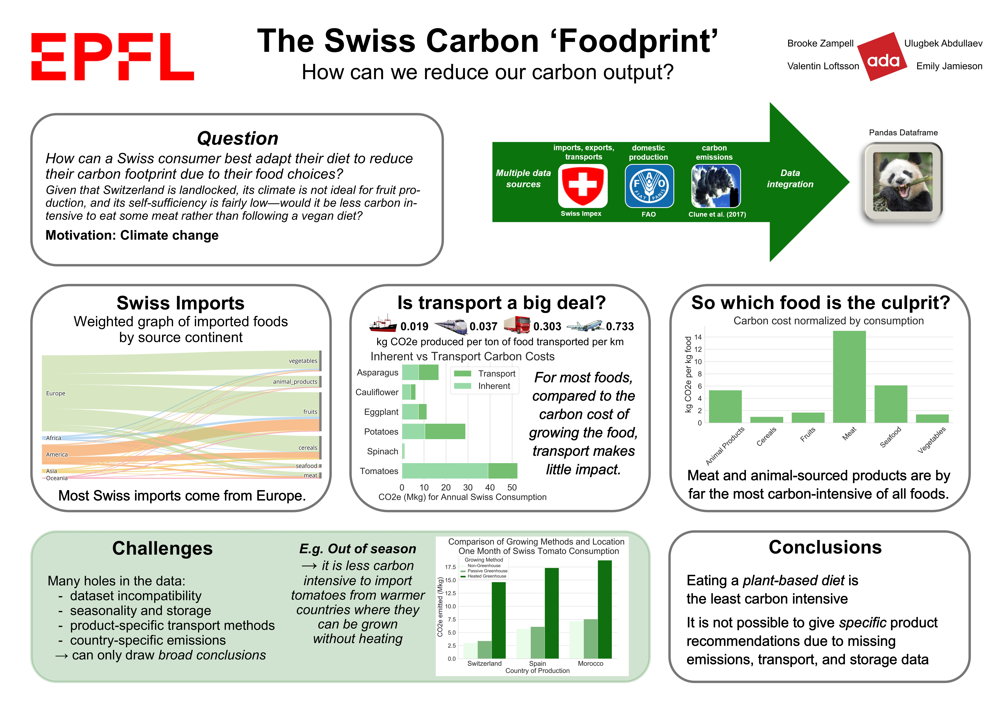

# Reducing the Swiss "Foodprint": How An Individual Can Adjust Their Carbon Output

Please refer to [our datastory](https://valentinoli.github.io/swiss-foodprint/) for a visual walk-through of our project and its results.

## Abstract
As the global discussion on human carbon emissions continues, more individuals are looking for ways to reduce their carbon footprint. One major contributor to carbon emissions is the food we eat. Some foods, such as meats and animal products, are known to be far more carbon-intensive per kg of food produced than plant-based food products. This would lead the carbon-conscious consumer to think that a vegetarian or vegan diet is the best path for an eco-friendly diet.

But what if this were not the case? In Switzerland, much of the meat is produced domestically due to the favorable climate for animals, while fruits do not grow well and are often imported from countries with warmer climates. So while carbon intensities for meats may be inherently higher, the carbon cost of transport increases the carbon intensities of imported foods. Is it possible that in Switzerland, it would be more environmentally friendly to eat the opposite of general recommendations?

The goal of this project was to look at several factors that go into the carbon cost of foods consumed in Switzerland, and to attempt to analyze how an individual might adjust their diet to lower their carbon "foodprint".

## Research Questions

This project will attempt to answer the following question:

> ### How can a Swiss consumer best adapt their diet to reduce their carbon "foodprint", based on several factors that go into the carbon emissions of food production?

Note that we are assuming this analysis will be utilized by a Swiss consumer, and not by the government or any authoritative figure. Therefore, the utility of this analysis comes while assuming that nothing about the given situation will change (for example, Switzerland will not make a policy to start domestically producing more bananas); rather, we are looking to give an individual consumer insight into their carbon levels.

## Sub-questions
* Among Swiss consumption, how much of the various food types (e.g. bananas, beef, oats) are domestically produced versus imported?
* How far away do these imports come from? (The farther food is imported from, generally the higher the associated carbon "cost" of transporting the food to Switzerland.)
* Among the various meats and animal products, which ones are more carbon-efficient? How do these compare to the carbon efficiency of plant-based foods?

## Datasets

There are two primary sets of data that we used to drive our analysis. 

The first is the [FAO](http://www.fao.org/faostat/en/#data) (Food and Agriculture Organisation of the United Nations) statistics dataset, which provides us with data specific to Switzerland regarding its crop and other food production. Since the latest available year for Swiss crop production is 2017, we will use 2017 data for all of our sources.

The second is [Swiss Impex](https://www.gate.ezv.admin.ch/swissimpex/index.xhtml), a site hosted by the Swiss Federal Customs Administration which gives detailed datasets of imports and exports for many food items, among other traded goods. Impex also provides data on the method of transport for food items, i.e. whether imported food came by air, boat, rail, or truck. 

Note that size is not an issue with our datasets, so we processed all data locally (not using Spark).

There are certain mismatches between data available from FAO and Impex. In these cases, assumptions were made about how to combine the data. Please see [the assumptions tab of our datastory](https://valentinoli.github.io/swiss-foodprint/assumptions/) for a detailed list of these decisions.

## Assumptions
Several large-scale assumptions had to be made to distill this massive question into a feasible project.

As mentioned above, this analysis is a consumer insight tool. We assume that no changes are made on the level of the government or other authoritative agents.

The most notable of all assumptions is the source of carbon intensities data. Many sources explain the impossibility of estimating the carbon intensities by crop type per country, since the amount of carbon that a crop's production causes depends on a _massive_ number of factors, and these factors vary widely even within a single country, from farm to farm. Thus, there is no data available for carbon intensities of all crops by country. To circumvent this, we will use the global average carbon intensities sourced from a large number of different studies and gathered in [this article](https://www.sciencedirect.com/science/article/pii/S0959652616303584).

Certain difficulties with the datasets were navigated by excluding or combining certain categories. For more details, please see the assumptions tab of our datastory.

We have included food waste as food consumption. That is, we calculated `Swiss food consumption` as `domestic production` - `exports` + `imports`.

We are only looking at the _carbon dioxide_ output. CO2 is only one of many greenhouse gases. So while this gives an informative picture, it is not all-encompassing. Where possible, however, values are provided as CO2 equivalents. That is, other greenhouse gases such as methane are given as an equivalent amount of CO2 in terms of their global warming potential.

Certain minor food groups, such as oils and sweets, were excluded from the analysis since they are not necessarily "recommended" foods to consume.

Finally, animals are often fed with by-products of human food production. If a consumer were to eat fewer meat/animal products, there would potentially be additional food waste to dispose of. The impact of this waste is not incorporated in this analysis.

## Results
Some of our findings matched expectations: accounting for transport carbon costs, meats are still by far the highest carbon intensity food group. Other findings were more surprising, such as the observation that transport is often not a significant contributor to the carbon cost of food. 

The most important finding of our research, however, was that this question is not so easily addressed as we had hoped in the beginning. There are an _incredible_ number of factors that go into the carbon intensity of a food item, and so many of them are impossible to account for on such a large scale. In the end, while we can rather confidently say that a plant-based diet is indeed better for the planet for Swiss consumers, it is difficult to quantify how much a given individual's diet contributes to carbon emissions.

For a more detailed analysis of our results, please see our datastory.

## Code Architecture
* [`src/`](src) directory contains the project notebook and required [`scripts/`](src/scripts)
* [`project.ipynb`](src/project.ipynb) is the project Jupyter notebook file
* [`impex_types.py`](src/scripts/impex_types.py) includes a dictionary for loading the Swiss-Impex data
* [`impex_data_manipulation.py`](src/scripts/impex_data_manipulation.py) includes scripts for loading and manipulating the Impex data
* [`impex_countries.py`](src/scripts/impex_countries.py) includes a function to load countries and continents
* [`fao_types.py`](src/scripts/fao_types.py) includes objects for facilitating the loading of FAO data and merging with the Impex data types
* [`fao_data_manipulation.py`](src/scripts/fao_data_manipulation.py) includes scripts for loading and manipulating the FAO data
* [`emmissions_data_manipulation.py`](src/scripts/emmissions_data_manipulation.py) includes scripts for loading and manipulating the emissions data
* [`plots.py`](scripts/plots.py) includes plotting functions
* [`combine_impex_data.py`](src/scripts/combine_impex_data.py) and [`combine-impex-data.ipynb`](src/scripts/combine-impex-data.ipynb) were used to preprocess the data and are not required to run the project notebook.

## Dependencies
* Data handling libraries:
    * [`pandas`](https://pandas.pydata.org/)
    * [`numpy`](https://numpy.org/)
* Plotting libraries:
    * [`matplotlib`](https://matplotlib.org/)
    * [`seaborn`](https://seaborn.pydata.org/)
    * [`bokeh`](https://docs.bokeh.org/en/latest/index.html)
    * [`holoviews`](http://holoviews.org/)
    * [`networkx`](https://networkx.github.io/)
* Misc. libraries:
    * [`geopy`](https://geopy.readthedocs.io/en/stable/)

## Data
[Download data](https://drive.google.com/drive/folders/1PafXlTB3gdwMsT65d55lvI0iEHwQNTG_?usp=sharing) (< 5MB)

## Reproduction
1. Clone or fork the repository
2. Download the data and add the `data/` folder to the root of the project
3. Install [Jupyter Notebook](https://jupyter.readthedocs.io/en/latest/install.html)
4. Install the above-mentioned dependencies
5. Run [`project.ipynb`](src/project.ipynb) to reproduce the data analysis

## Authors and Contributions
* Brooke Zampell, [brooke.zampell@epfl.ch](mailto:brooke.zampell@epfl.ch)
  * Project mastermind, data sourcing and manipulation, visualizations, commentary, data story
* Emily Jamieson, [emily.jamieson@epfl.ch](mailto:emily.jamieson@epfl.ch)
  * Emissions data loading and manipulation, visualizations, commentary, data story
* Ulugbek Abdullaev, [ulugbek.abdullaev@epfl.ch](mailto:ulugbek.abdullaev@epfl.ch)
  * Data story, graph visualizations
* Valentin Oliver Loftsson, [valentin.loftsson@epfl.ch](mailto:valentin.loftsson@epfl.ch)
  * Data loading and manipulation (except emissions), multi-indexing, merging FAO and Impex data sets, code reviewing, visualizations, commentary

## License
This project is licensed under the MIT License - see the [LICENSE](LICENSE) file for details.

